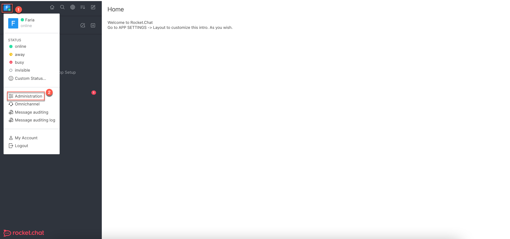

# Meta

With the Meta configuration, you can set custom meta properties for your server.

Meta elements are tags used in HTML and XHTML documents to provide structured metadata about a Web page, they are usually very important for SEO besides others

To access this section, go to **Administration** > **Settings** > **Meta**.



 (1).png>)

* **Language**: Lets you set the meta language. eg `en`
* **Facebook App Id**: When provided, it will allow the Facebook scraper to associate the Open Graph entity with your server.
* **Robots**: Specify to tell search engines what to and what not to index or follow
* **Google Site Verification**: Input metatag to verify you own the server/site.
* **MSValidate.01**: A tag that is to be added to your site (header) to verify your site with the Bing webmaster tool.
* **Custom Meta Tags**: Any custom meta tags you wish to include. Example

```
<meta http-equiv="Content-Type" content="text/html; charset=utf-8" />
<meta http-equiv="Content-Type" content="text/html; charset=ISO-8859-1">
```
